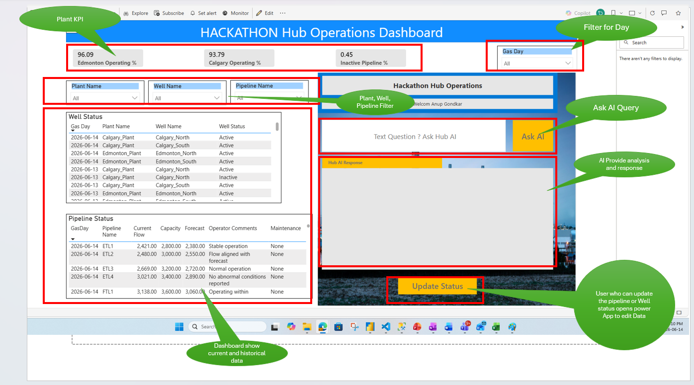
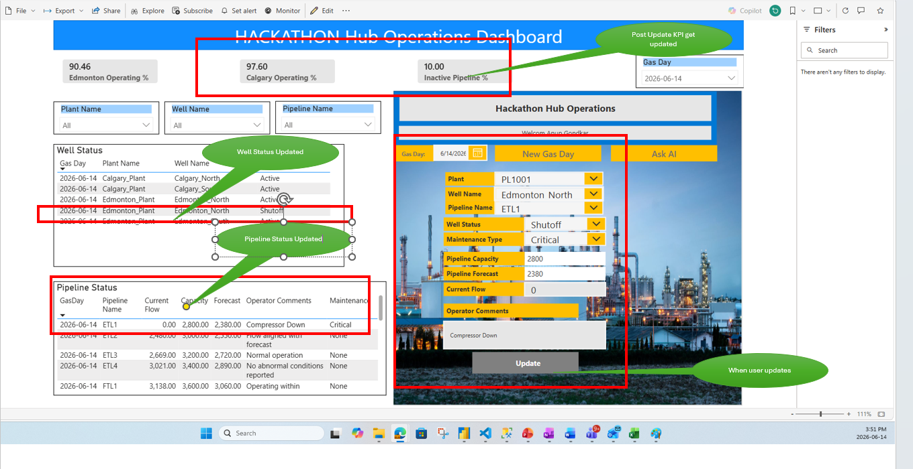
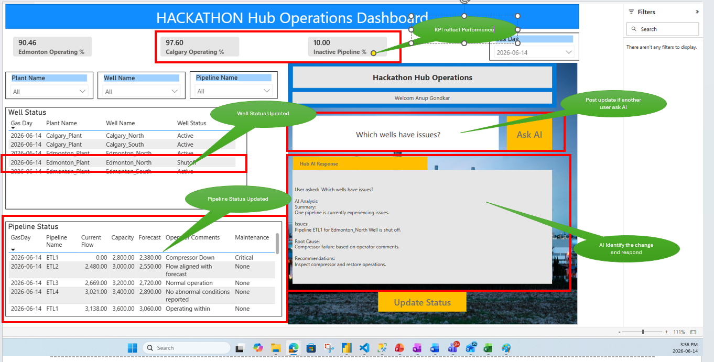

# Hub-Operations-AI-Agent
Enterprise AI-powered Hub Operations Dashboard using Power BI, Power Apps, and Power Automate for real-time insights and decision support.

Intelligent Hub Operations Dashboard with AI Agent
Overview:
This project demonstrates an enterprise-grade solution for monitoring gas pipeline operations using Power BI, Power Apps, and Power Automate. It enables real-time updates, analytics, and AI-driven insights.

Problem Statement:
Operations teams rely on manual analysis to detect performance issues such as underperforming pipelines or inactive wells, leading to delayed decisions.

Solution:
The system integrates analytics with AI to provide real-time insights, root cause analysis, and recommendations through a unified interface.

Architecture:
Power Apps → Power Automate → Power BI → SharePoint/Data Source

Key Features:
- Real-time monitoring
- Data updates via Power Apps
- AI assistant for insights
- Context-based responses

AI Scenarios:
1. No underperformance detected
2. Issue detected after update (e.g., compressor failure)
3. Historical insight (inactive wells yesterday)

Technologies Used:
Power Apps, Power Automate, Power BI, SharePoint

Business Value:
Improves operational efficiency, reduces downtime, and enables faster decision-making.

## 📷 Screenshots

### 1. Dashboard Overview

---

### 2. AI Query & Response

---
### 3. Power App Update Flow

---

### 4. Post Update AI Detection

Author:
Anup Gondkar

