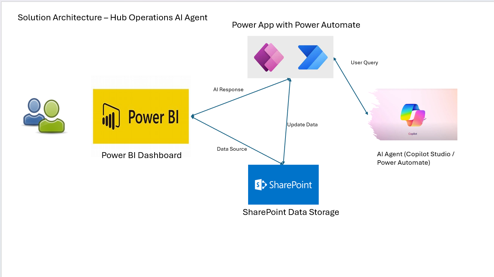
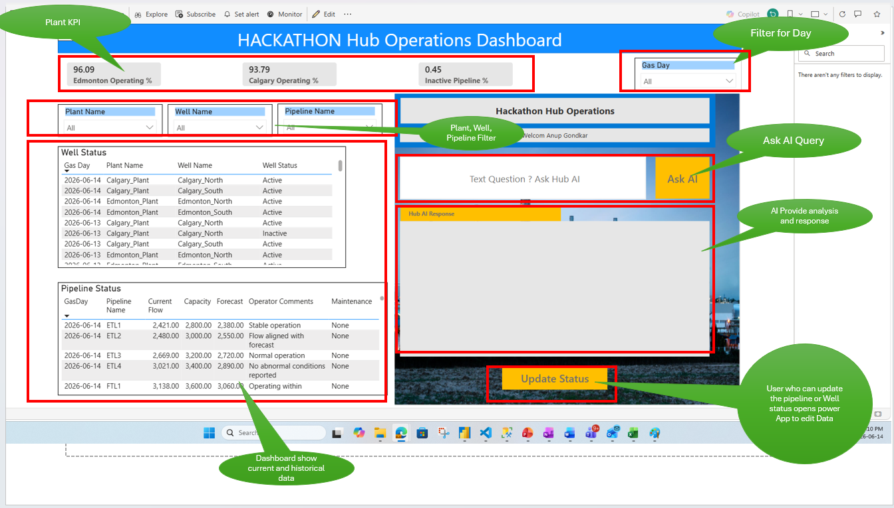

# 🚀 Hub Operations AI Agent

Enterprise AI-powered Hub Operations Dashboard using Power BI, Power Apps, and Power Automate for real-time insights and decision support.

---

## 📌 Overview
This project demonstrates an enterprise-grade solution for monitoring gas pipeline operations using Power BI, Power Apps, and Power Automate.  

It enables:
- Real-time updates  
- Analytics  
- AI-driven insights  

---

## 🎯 Problem Statement
Operations teams rely on manual analysis to detect performance issues such as underperforming pipelines or inactive wells, leading to delayed decisions.

---

## ✅ Solution
The system integrates analytics with AI to provide:
- Real-time insights  
- Root cause analysis  
- Actionable recommendations  

All within a unified interface.

---

## 🏗️ Architecture
Power Apps → Power Automate → Power BI → SharePoint/Data Source  

---

## ⚡ Key Features
- ✅ Real-time monitoring  
- ✅ Data updates via Power Apps  
- ✅ AI assistant for insights  
- ✅ Context-based responses  

---

## 🤖 AI Scenarios
1. ✅ No underperformance detected  
2. ⚠️ Issue detected after update (compressor failure)  
3. 📊 Historical insight (inactive wells yesterday)  

---

## 🛠️ Technologies Used
- Microsoft Power Apps  
- Microsoft Power Automate  
- Microsoft Power BI  
- SharePoint  

---

## 📊 Business Value
- 🚀 Improves operational efficiency  
- ⏱️ Reduces downtime  
- 🎯 Enables faster decision-making  

---

## 📷 Screenshots

### 1. 📊 Dashboard Overview

---

### 2. 🤖 AI Query & Response

---

### 3. 🔄 Power App Update Flow

---

### 4. ⚠️ Post Update AI Detection

---

## 👨‍💻 Author
**Anup Gondkar**
``
